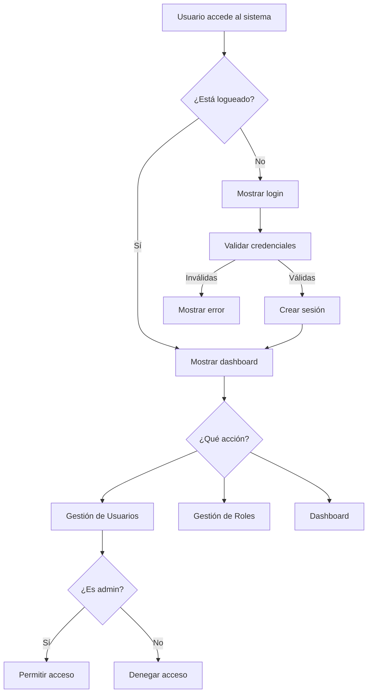

# 📋 Manual Completo del Sistema de Votación

## 📖 Tabla de Contenidos

1. [Introducción](#introducción)
2. [Características del Sistema](#características-del-sistema)
3. [Arquitectura del Sistema](#arquitectura-del-sistema)
4. [Roles y Permisos](#roles-y-permisos)
5. [Instalación y Configuración](#instalación-y-configuración)
6. [Guía de Usuario](#guía-de-usuario)
7. [Documentación Técnica](#documentación-técnica)
8. [Solución de Problemas](#solución-de-problemas)
9. [FAQ - Preguntas Frecuentes](#faq---preguntas-frecuentes)

---

## 🚀 Introducción

El **Sistema de Votación** es una aplicación web desarrollada en PHP que permite la gestión de usuarios y roles de manera segura y eficiente. Está diseñado siguiendo el patrón de arquitectura **MVC (Model-View-Controller)** y utiliza tecnologías modernas para garantizar una experiencia de usuario óptima.

### ✨ Características Principales

- 🔐 **Sistema de autenticación seguro** con hash de contraseñas
- 👥 **Gestión de usuarios** con diferentes niveles de acceso
- 🛡️ **Control de roles y permisos** granular
- 📱 **Interfaz responsive** compatible con dispositivos móviles
- 🎨 **Diseño moderno** utilizando Bootstrap 5
- 🔒 **Seguridad avanzada** con protección contra ataques comunes

---

## 🏗️ Arquitectura del Sistema

### Patrón MVC

```
📁 Sistema de Votación
├── 📁 app/
│   ├── 📁 controllers/    # Lógica de control
│   ├── 📁 models/         # Lógica de datos
│   └── 📁 views/          # Presentación
├── 📁 core/               # Clases base del framework
├── 📁 config/             # Configuraciones
├── 📁 assets/             # Recursos estáticos
├── 📁 database/           # Scripts de base de datos
└── 📁 docs/               # Documentación
```

### Diagrama de Flujo del Sistema



---

## 👥 Roles y Permisos

### 🔴 Administrador (admin)
**Acceso Completo** - Puede realizar todas las operaciones del sistema

#### Permisos:
- ✅ Ver dashboard
- ✅ Gestionar usuarios (crear, editar, eliminar)
- ✅ Gestionar roles
- ✅ Acceso a todas las funcionalidades

#### Menú disponible:
- Dashboard
- Usuarios
- Roles

### 🟡 Editor Principal (editor)
**Acceso Limitado** - Puede editar contenido pero no gestionar usuarios

#### Permisos:
- ✅ Ver dashboard
- ❌ Gestionar usuarios
- ❌ Gestionar roles

#### Menú disponible:
- Dashboard

### 🟢 Viewer (viewer)
**Solo Lectura** - Puede ver información pero no modificar

#### Permisos:
- ✅ Ver dashboard
- ❌ Gestionar usuarios
- ❌ Gestionar roles

#### Menú disponible:
- Dashboard

---

## ⚙️ Instalación y Configuración

### Requisitos del Sistema

- **PHP** 7.4 o superior
- **MySQL** 5.7 o superior
- **Apache** con mod_rewrite habilitado
- **XAMPP** (recomendado para desarrollo)

### Pasos de Instalación

1. **Clonar o copiar** el proyecto en la carpeta `htdocs` de XAMPP
2. **Importar** la base de datos usando el archivo `database/schema.sql`
3. **Configurar** la conexión a base de datos en `config/config.php`
4. **Verificar** permisos de archivos
5. **Acceder** al sistema desde `http://localhost/voto/`

### Configuración Inicial

#### Base de Datos
```sql
-- La base de datos se crea automáticamente con:
- 3 roles predefinidos (admin, editor, viewer)
- Usuario administrador por defecto
- Estructuras de tablas optimizadas
```

#### Credenciales por Defecto
- **Usuario:** admin
- **Contraseña:** Estatanteria12022

---

## 🎮 Guía de Usuario

### Inicio de Sesión

1. **Acceder** a `http://localhost/voto/`
2. **Ingresar** credenciales:
   - Usuario: `admin`
   - Contraseña: `Estatanteria12022`
3. **Hacer clic** en "Iniciar Sesión"

### Navegación del Sistema

#### Dashboard
- **Pantalla principal** después del login
- **Resumen** de información del sistema
- **Acceso rápido** a funcionalidades principales

#### Gestión de Usuarios (Solo Admin)
- **Ver lista** de todos los usuarios
- **Crear** nuevos usuarios
- **Editar** usuarios existentes
- **Eliminar** usuarios (excepto el propio)
- **Filtrar** por rol y estado

#### Gestión de Roles (Solo Admin)
- **Ver lista** de roles disponibles
- **Crear** nuevos roles
- **Editar** roles existentes
- **Asignar** permisos específicos

### Funcionalidades por Pantalla

#### 🏠 Dashboard
```
┌─────────────────────────────────────┐
│ Dashboard - Sistema de Votación     │
├─────────────────────────────────────┤
│ 📊 Estadísticas del Sistema         │
│ • Total de usuarios: XX             │
│ • Usuarios activos: XX              │
│ • Roles configurados: XX            │
│                                     │
│ 🔗 Accesos Rápidos                  │
│ [➕ Nuevo Usuario] [⚙️ Configurar]  │
└─────────────────────────────────────┘
```

#### 👥 Gestión de Usuarios (Solo Admin)
```
┌─────────────────────────────────────┐
│ Gestión de Usuarios                 │
├─────────────────────────────────────┤
│ [➕ Nuevo Usuario]         [🔍 Buscar] │
│                                     │
│ │ID│ Usuario │ Email │ Rol │ Estado │
│ ├──┼─────────┼───────┼─────┼────────│
│ │1 │ admin   │ ...   │Admin│ Activo │
│ │2 │ editor1 │ ...   │Edit │ Activo │
│ │3 │ viewer1 │ ...   │View │ Activo │
│                                     │
│ [✏️ Editar] [🗑️ Eliminar]            │
└─────────────────────────────────────┘
```

---

## 🔧 Documentación Técnica

### Estructura de Archivos

#### Controladores (`app/controllers/`)
- `AuthController.php` - Autenticación y sesiones
- `DashboardController.php` - Pantalla principal
- `UserController.php` - Gestión de usuarios
- `RoleController.php` - Gestión de roles
- `ErrorController.php` - Manejo de errores

#### Modelos (`app/models/`)
- `User.php` - Operaciones de usuarios
- `Role.php` - Operaciones de roles

#### Vistas (`app/views/`)
```
views/
├── auth/
│   └── login.php
├── dashboard/
│   └── index.php
├── users/
│   ├── index.php
│   ├── create.php
│   └── edit.php
├── roles/
│   ├── index.php
│   ├── create.php
│   └── edit.php
└── layouts/
    └── main.php
```

### Base de Datos

#### Tabla: users
```sql
CREATE TABLE users (
    id INT AUTO_INCREMENT PRIMARY KEY,
    username VARCHAR(50) NOT NULL UNIQUE,
    email VARCHAR(100) NOT NULL UNIQUE,
    password VARCHAR(255) NOT NULL,
    first_name VARCHAR(50) NOT NULL,
    last_name VARCHAR(50) NOT NULL,
    role_id INT,
    status ENUM('active', 'inactive') DEFAULT 'active',
    last_login TIMESTAMP NULL,
    created_at TIMESTAMP DEFAULT CURRENT_TIMESTAMP,
    updated_at TIMESTAMP DEFAULT CURRENT_TIMESTAMP ON UPDATE CURRENT_TIMESTAMP,
    FOREIGN KEY (role_id) REFERENCES roles(id) ON DELETE SET NULL
);
```

#### Tabla: roles
```sql
CREATE TABLE roles (
    id INT AUTO_INCREMENT PRIMARY KEY,
    name VARCHAR(50) NOT NULL UNIQUE,
    description TEXT NOT NULL,
    status ENUM('active', 'inactive') DEFAULT 'active',
    created_at TIMESTAMP DEFAULT CURRENT_TIMESTAMP,
    updated_at TIMESTAMP DEFAULT CURRENT_TIMESTAMP ON UPDATE CURRENT_TIMESTAMP
);
```

### Seguridad Implementada

#### 🔐 Autenticación
- **Hash de contraseñas** usando `password_hash()` de PHP
- **Validación de sesiones** en cada request
- **Protección contra** ataques de fuerza bruta

#### 🛡️ Autorización
- **Control de acceso basado en roles** (RBAC)
- **Validación de permisos** en controladores
- **Redirección automática** para usuarios no autorizados

#### 🔒 Protección General
- **Sanitización de inputs** para prevenir XSS
- **Prepared statements** para prevenir SQL injection
- **Headers de seguridad** configurados

---

## 🆘 Solución de Problemas

### Problemas Comunes

#### ❌ Error 500 - Internal Server Error
**Causas posibles:**
- Configuración incorrecta de `.htaccess`
- Permisos de archivos incorrectos
- Error en configuración de PHP

**Soluciones:**
1. Verificar logs de Apache: `/Applications/XAMPP/xamppfiles/logs/error_log`
2. Revisar configuración de `.htaccess`
3. Verificar permisos de archivos (755 para carpetas, 644 para archivos)

#### ❌ No se puede conectar a la base de datos
**Causas posibles:**
- MySQL no está ejecutándose
- Credenciales incorrectas en `config/config.php`
- Base de datos no existe

**Soluciones:**
1. Verificar que MySQL esté funcionando en XAMPP
2. Revisar configuración en `config/config.php`
3. Importar el archivo `database/schema.sql`

#### ❌ Credenciales incorrectas
**Causas posibles:**
- Contraseña incorrecta
- Usuario no existe
- Hash de contraseña corrupto

**Soluciones:**
1. Verificar credenciales: admin / Estatanteria12022
2. Resetear contraseña desde base de datos si es necesario

### Logs del Sistema

#### Logs de Apache
```bash
tail -f /Applications/XAMPP/xamppfiles/logs/error_log
```

#### Logs de MySQL
```bash
tail -f /Applications/XAMPP/xamppfiles/logs/mysql_error.log
```

---

## ❓ FAQ - Preguntas Frecuentes

### 🔍 Generales

**P: ¿Qué tecnologías utiliza el sistema?**
R: PHP 8.2, MySQL, Bootstrap 5, Apache, siguiendo el patrón MVC.

**P: ¿Es compatible con dispositivos móviles?**
R: Sí, la interfaz es completamente responsive y funciona en todos los dispositivos.

**P: ¿Se puede personalizar el diseño?**
R: Sí, modificando los archivos CSS y las vistas en `app/views/`.

### 🔐 Seguridad

**P: ¿Cómo se almacenan las contraseñas?**
R: Se utiliza `password_hash()` de PHP con el algoritmo bcrypt para hash seguro.

**P: ¿Qué protecciones tiene contra ataques?**
R: Protección contra XSS, SQL injection, CSRF y ataques de fuerza bruta.

**P: ¿Se pueden agregar más roles?**
R: Sí, el sistema permite crear roles personalizados desde la interfaz de administración.

### 🛠️ Técnicas

**P: ¿Cómo agregar nuevas funcionalidades?**
R: Siguiendo el patrón MVC: crear controlador, modelo y vista correspondientes.

**P: ¿Se puede cambiar la base de datos?**
R: Sí, modificando la configuración en `config/database.php` y ajustando los modelos.

**P: ¿Cómo hacer backup del sistema?**
R: Exportar la base de datos MySQL y copiar todos los archivos del proyecto.

---

## 📞 Soporte y Contacto

### 🔗 Enlaces Útiles
- **Repositorio:** [GitHub](https://github.com/ivankorner/voto)
- **Documentación PHP:** [php.net](https://php.net)
- **Bootstrap:** [getbootstrap.com](https://getbootstrap.com)

### 📋 Información de Versión
- **Versión:** 1.0.0
- **Fecha de creación:** Septiembre 2025
- **Última actualización:** 12 de septiembre de 2025

---

*Este manual fue generado automáticamente para el Sistema de Votación. Para más información, consulte la documentación técnica en la carpeta `docs/`.*