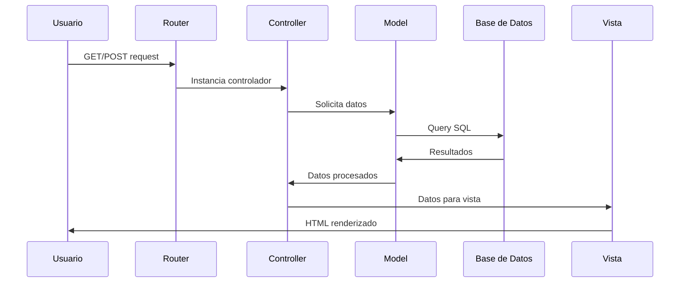
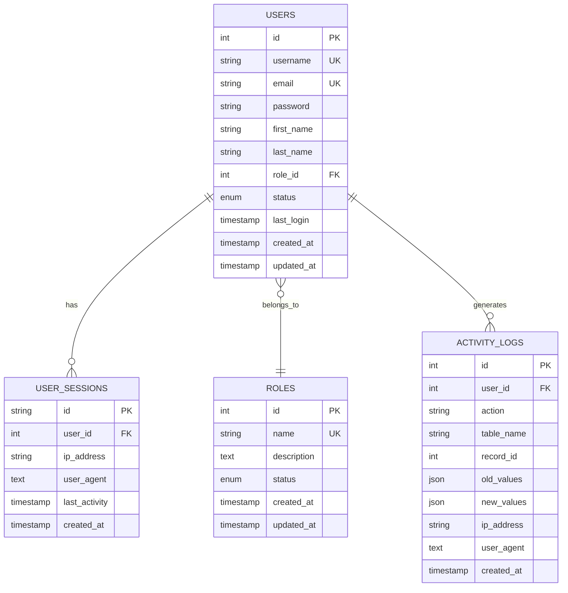

# 🔧 Documentación Técnica - Sistema de Votación

## 📋 Tabla de Contenidos

1. [Arquitectura del Sistema](#arquitectura-del-sistema)
2. [Estructura de Archivos](#estructura-de-archivos)
3. [Patrones de Diseño](#patrones-de-diseño)
4. [Base de Datos](#base-de-datos)
5. [APIs y Controladores](#apis-y-controladores)
6. [Seguridad](#seguridad)
7. [Configuración](#configuración)
8. [Desarrollo](#desarrollo)

---

## 🏗️ Arquitectura del Sistema

### Patrón MVC (Model-View-Controller)

```
┌─────────────────┐    ┌─────────────────┐    ┌─────────────────┐
│     VIEW        │    │   CONTROLLER    │    │     MODEL       │
│                 │    │                 │    │                 │
│ • login.php     │◄───┤ • AuthController│◄───┤ • User.php      │
│ • dashboard.php │    │ • UserController│    │ • Role.php      │
│ • users/*.php   │    │ • RoleController│    │                 │
│ • layouts/*.php │    │ • ErrorController│   │                 │
└─────────────────┘    └─────────────────┘    └─────────────────┘
         │                       │                       │
         └───────────────────────┼───────────────────────┘
                                 │
                    ┌─────────────────┐
                    │     ROUTER      │
                    │                 │
                    │ • Maneja URLs   │
                    │ • Enruta requests│
                    │ • Carga controles│
                    └─────────────────┘
```

### Flujo de Procesamiento de Requests



---

## 📁 Estructura de Archivos

### Estructura Completa del Proyecto

```
voto/
├── 📄 index.php                 # Punto de entrada principal
├── 📄 .htaccess                 # Configuración de reescritura de URLs
├── 📄 README.md                 # Documentación básica
│
├── 📁 app/                      # Aplicación principal
│   ├── 📁 controllers/          # Controladores MVC
│   │   ├── 📄 AuthController.php
│   │   ├── 📄 DashboardController.php
│   │   ├── 📄 ErrorController.php
│   │   ├── 📄 RoleController.php
│   │   └── 📄 UserController.php
│   │
│   ├── 📁 models/               # Modelos de datos
│   │   ├── 📄 Role.php
│   │   └── 📄 User.php
│   │
│   └── 📁 views/                # Vistas (templates)
│       ├── 📁 auth/
│       │   └── 📄 login.php
│       ├── 📁 dashboard/
│       │   └── 📄 index.php
│       ├── 📁 errors/
│       │   └── 📄 404.php
│       ├── 📁 layouts/
│       │   └── 📄 main.php
│       ├── 📁 roles/
│       │   ├── 📄 create.php
│       │   ├── 📄 edit.php
│       │   └── 📄 index.php
│       └── 📁 users/
│           ├── 📄 create.php
│           ├── 📄 edit.php
│           └── 📄 index.php
│
├── 📁 assets/                   # Recursos estáticos
│   ├── 📁 css/
│   │   └── 📄 style.css
│   └── 📁 js/
│       └── 📄 script.js
│
├── 📁 config/                   # Configuraciones
│   ├── 📄 config.php            # Configuración general
│   └── 📄 database.php          # Configuración de BD
│
├── 📁 core/                     # Framework básico
│   ├── 📄 Controller.php        # Clase base de controladores
│   ├── 📄 Model.php             # Clase base de modelos
│   └── 📄 Router.php            # Enrutador
│
├── 📁 database/                 # Scripts de base de datos
│   └── 📄 schema.sql            # Esquema de la BD
│
└── 📁 docs/                     # Documentación
    ├── 📄 README.md             # Manual principal
    ├── 📄 TECHNICAL.md          # Documentación técnica
    ├── 📁 guides/               # Guías específicas
    └── 📁 assets/               # Recursos de documentación
```

### Descripción de Archivos Principales

#### 🚀 Punto de Entrada
- **`index.php`**: Punto de entrada principal que inicializa el sistema y carga el router

#### ⚙️ Core del Framework
- **`core/Router.php`**: Maneja el enrutamiento de URLs
- **`core/Controller.php`**: Clase base para todos los controladores
- **`core/Model.php`**: Clase base para todos los modelos

#### 🎮 Controladores
- **`AuthController.php`**: Autenticación y manejo de sesiones
- **`UserController.php`**: CRUD de usuarios
- **`RoleController.php`**: CRUD de roles
- **`DashboardController.php`**: Pantalla principal
- **`ErrorController.php`**: Manejo de errores

---

## 🎨 Patrones de Diseño

### 1. MVC (Model-View-Controller)
```php
// Ejemplo de flujo MVC
class UserController extends Controller {
    public function index() {
        // Controller: Lógica de control
        $this->requireAdmin();
        
        // Model: Obtener datos
        $userModel = $this->loadModel('User');
        $users = $userModel->getUsersWithRoles();
        
        // View: Preparar datos para vista
        $data = ['users' => $users];
        $this->loadView('users/index', $data);
    }
}
```

### 2. Singleton (Database)
```php
class Database {
    private static $instance = null;
    
    public static function getInstance() {
        if (self::$instance === null) {
            self::$instance = new self();
        }
        return self::$instance;
    }
}
```

### 3. Active Record (Models)
```php
class User extends Model {
    protected $table = 'users';
    
    public function findById($id) {
        return $this->find($id);
    }
}
```

---

## 🗄️ Base de Datos

### Esquema de Datos

#### Tabla: `users`
```sql
CREATE TABLE users (
    id INT AUTO_INCREMENT PRIMARY KEY,
    username VARCHAR(50) NOT NULL UNIQUE,
    email VARCHAR(100) NOT NULL UNIQUE,
    password VARCHAR(255) NOT NULL,
    first_name VARCHAR(50) NOT NULL,
    last_name VARCHAR(50) NOT NULL,
    role_id INT,
    status ENUM('active', 'inactive') DEFAULT 'active',
    last_login TIMESTAMP NULL,
    created_at TIMESTAMP DEFAULT CURRENT_TIMESTAMP,
    updated_at TIMESTAMP DEFAULT CURRENT_TIMESTAMP ON UPDATE CURRENT_TIMESTAMP,
    FOREIGN KEY (role_id) REFERENCES roles(id) ON DELETE SET NULL
);
```

#### Tabla: `roles`
```sql
CREATE TABLE roles (
    id INT AUTO_INCREMENT PRIMARY KEY,
    name VARCHAR(50) NOT NULL UNIQUE,
    description TEXT NOT NULL,
    status ENUM('active', 'inactive') DEFAULT 'active',
    created_at TIMESTAMP DEFAULT CURRENT_TIMESTAMP,
    updated_at TIMESTAMP DEFAULT CURRENT_TIMESTAMP ON UPDATE CURRENT_TIMESTAMP
);
```

#### Tabla: `user_sessions`
```sql
CREATE TABLE user_sessions (
    id VARCHAR(128) PRIMARY KEY,
    user_id INT NOT NULL,
    ip_address VARCHAR(45),
    user_agent TEXT,
    last_activity TIMESTAMP DEFAULT CURRENT_TIMESTAMP ON UPDATE CURRENT_TIMESTAMP,
    created_at TIMESTAMP DEFAULT CURRENT_TIMESTAMP,
    FOREIGN KEY (user_id) REFERENCES users(id) ON DELETE CASCADE
);
```

#### Tabla: `activity_logs`
```sql
CREATE TABLE activity_logs (
    id INT AUTO_INCREMENT PRIMARY KEY,
    user_id INT,
    action VARCHAR(100) NOT NULL,
    table_name VARCHAR(50),
    record_id INT,
    old_values JSON,
    new_values JSON,
    ip_address VARCHAR(45),
    user_agent TEXT,
    created_at TIMESTAMP DEFAULT CURRENT_TIMESTAMP,
    FOREIGN KEY (user_id) REFERENCES users(id) ON DELETE SET NULL
);
```

### Relaciones de Datos



---

## 🔌 APIs y Controladores

### Estructura de Controladores

#### Clase Base: `Controller`
```php
class Controller {
    // Métodos de utilidad
    protected function loadModel($model);     // Cargar modelo
    protected function loadView($view, $data); // Cargar vista
    protected function redirect($url);        // Redireccionar
    
    // Métodos de autenticación
    protected function isLoggedIn();          // Verificar login
    protected function requireLogin();        // Requerir login
    protected function hasRole($role);        // Verificar rol
    protected function requireRole($role);    // Requerir rol
    protected function requireAdmin();        // Requerir admin
}
```

#### AuthController - Métodos
```php
class AuthController extends Controller {
    public function login()  // GET/POST - Formulario de login
    public function logout() // GET - Cerrar sesión
}
```

#### UserController - Métodos
```php
class UserController extends Controller {
    public function index()  // GET - Lista de usuarios
    public function create() // GET/POST - Crear usuario
    public function edit()   // GET/POST - Editar usuario
    public function delete() // POST - Eliminar usuario
}
```

#### RoleController - Métodos
```php
class RoleController extends Controller {
    public function index()  // GET - Lista de roles
    public function create() // GET/POST - Crear rol
    public function edit()   // GET/POST - Editar rol
    public function delete() // POST - Eliminar rol
}
```

### Rutas del Sistema

```php
// Configuración en Router.php
$this->routes = [
    ''                => ['controller' => 'AuthController', 'method' => 'login'],
    'login'           => ['controller' => 'AuthController', 'method' => 'login'],
    'logout'          => ['controller' => 'AuthController', 'method' => 'logout'],
    'dashboard'       => ['controller' => 'DashboardController', 'method' => 'index'],
    'users'           => ['controller' => 'UserController', 'method' => 'index'],
    'users/create'    => ['controller' => 'UserController', 'method' => 'create'],
    'users/edit'      => ['controller' => 'UserController', 'method' => 'edit'],
    'users/delete'    => ['controller' => 'UserController', 'method' => 'delete'],
    'roles'           => ['controller' => 'RoleController', 'method' => 'index'],
    'roles/create'    => ['controller' => 'RoleController', 'method' => 'create'],
    'roles/edit'      => ['controller' => 'RoleController', 'method' => 'edit'],
    'roles/delete'    => ['controller' => 'RoleController', 'method' => 'delete'],
];
```

---

## 🔒 Seguridad

### Autenticación

#### Hash de Contraseñas
```php
// Crear hash al registrar usuario
$password = password_hash($plainPassword, PASSWORD_DEFAULT);

// Verificar en login
if (password_verify($inputPassword, $storedHash)) {
    // Login válido
}
```

#### Gestión de Sesiones
```php
// Iniciar sesión
session_start();
$_SESSION['user_id'] = $user['id'];
$_SESSION['user_role'] = $user['role'];

// Verificar sesión
if (!isset($_SESSION['user_id'])) {
    redirect('login');
}
```

### Autorización

#### Control de Acceso Basado en Roles (RBAC)
```php
// En controladores
$this->requireAdmin();     // Solo administradores
$this->requireRole('editor'); // Solo editores

// En vistas
<?php if ($_SESSION['user_role'] === 'admin'): ?>
    <!-- Contenido solo para admin -->
<?php endif; ?>
```

### Prevención de Ataques

#### SQL Injection
```php
// Usar prepared statements
$stmt = $this->db->prepare("SELECT * FROM users WHERE id = ?");
$stmt->execute([$id]);
```

#### XSS (Cross-Site Scripting)
```php
// Escapar output en vistas
echo htmlspecialchars($user_input, ENT_QUOTES, 'UTF-8');
```

#### CSRF (Cross-Site Request Forgery)
```php
// Verificar método HTTP
if ($_SERVER['REQUEST_METHOD'] !== 'POST') {
    return false;
}
```

---

## ⚙️ Configuración

### Archivo: `config/config.php`
```php
<?php
// URLs y rutas
define('BASE_URL', 'http://localhost/voto/');
define('APP_NAME', 'Sistema de Votación');

// Base de datos
define('DB_HOST', 'localhost');
define('DB_NAME', 'voto_db');
define('DB_USER', 'root');
define('DB_PASS', '');

// Rutas del sistema
define('CONTROLLERS_PATH', 'app/controllers/');
define('MODELS_PATH', 'app/models/');
define('VIEWS_PATH', 'app/views/');

// Configuración de sesión
ini_set('session.cookie_httponly', 1);
ini_set('session.use_only_cookies', 1);
ini_set('session.cookie_secure', 0); // 1 en producción con HTTPS
?>
```

### Archivo: `.htaccess`
```apache
RewriteEngine On

# Redirigir todas las solicitudes al index.php
RewriteCond %{REQUEST_FILENAME} !-f
RewriteCond %{REQUEST_FILENAME} !-d
RewriteRule ^(.*)$ index.php?url=$1 [QSA,L]
```

---

## 🛠️ Desarrollo

### Estándares de Código

#### Nomenclatura
- **Clases**: PascalCase (`UserController`, `AuthModel`)
- **Métodos**: camelCase (`getUserById`, `validateLogin`)
- **Variables**: snake_case (`$user_id`, `$first_name`)
- **Constantes**: UPPER_CASE (`BASE_URL`, `DB_HOST`)

#### Estructura de Archivos
```php
<?php
// Comentario de encabezado
require_once 'path/to/dependency.php';

class ClassName extends BaseClass {
    // Propiedades
    private $property;
    
    // Constructor
    public function __construct() {
        // Inicialización
    }
    
    // Métodos públicos
    public function publicMethod() {
        // Lógica
    }
    
    // Métodos privados
    private function privateMethod() {
        // Lógica interna
    }
}
?>
```

### Agregar Nuevas Funcionalidades

#### 1. Crear Controlador
```php
// app/controllers/NewController.php
<?php
require_once 'core/Controller.php';

class NewController extends Controller {
    public function index() {
        $this->requireLogin();
        // Lógica del controlador
        $this->loadView('new/index');
    }
}
?>
```

#### 2. Crear Modelo
```php
// app/models/NewModel.php
<?php
require_once 'core/Model.php';

class NewModel extends Model {
    protected $table = 'new_table';
    
    public function customMethod() {
        // Lógica del modelo
    }
}
?>
```

#### 3. Crear Vista
```php
<!-- app/views/new/index.php -->
<?php
$current_page = 'new';
$page_title = 'Nueva Funcionalidad';
ob_start();
?>

<div class="container">
    <h1>Nueva Funcionalidad</h1>
    <!-- Contenido de la vista -->
</div>

<?php
$content = ob_get_clean();
require_once VIEWS_PATH . 'layouts/main.php';
?>
```

#### 4. Agregar Ruta
```php
// core/Router.php - método addRoutes()
'new' => ['controller' => 'NewController', 'method' => 'index'],
```

### Testing y Debugging

#### Logs de Debug
```php
// Habilitar errores de PHP
error_reporting(E_ALL);
ini_set('display_errors', 1);

// Log personalizado
error_log("Debug: " . print_r($data, true));
```

#### Verificación de Base de Datos
```php
// Verificar conexión
try {
    $db = Database::getInstance();
    echo "Conexión exitosa";
} catch (Exception $e) {
    echo "Error: " . $e->getMessage();
}
```

---

## 📊 Métricas y Optimización

### Performance

#### Optimizaciones Implementadas
- **Prepared Statements** para consultas SQL
- **Índices** en campos de búsqueda frecuente
- **Singleton Pattern** para conexión de BD
- **CSS/JS** minificados en producción

#### Monitoreo
```sql
-- Consultas lentas
SHOW PROCESSLIST;

-- Uso de índices
EXPLAIN SELECT * FROM users WHERE username = 'admin';
```

### Escalabilidad

#### Consideraciones
- **Separación de capas** (MVC)
- **Configuración externa** para diferentes entornos
- **Logs estructurados** para monitoreo
- **Cache** de consultas frecuentes (futuro)

---

*Documentación técnica generada para el Sistema de Votación v1.0.0*