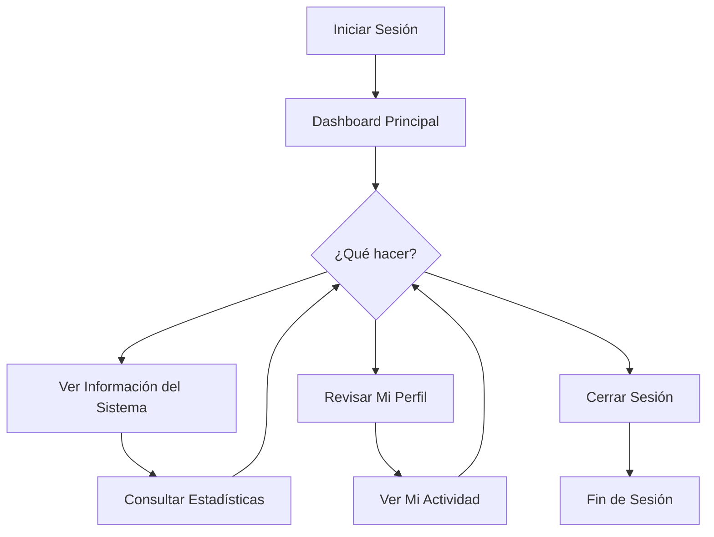

# 📝 Guía del Editor - Sistema de Votación

## 📋 Tabla de Contenidos

1. [Introducción](#introducción)
2. [Acceso al Sistema](#acceso-al-sistema)
3. [Dashboard del Editor](#dashboard-del-editor)
4. [Funcionalidades Disponibles](#funcionalidades-disponibles)
5. [Flujo de Trabajo](#flujo-de-trabajo)
6. [Buenas Prácticas](#buenas-prácticas)
7. [Limitaciones y Restricciones](#limitaciones-y-restricciones)
8. [Preguntas Frecuentes](#preguntas-frecuentes)

---

## 🚀 Introducción

Como **Editor Principal** del Sistema de Votación, tienes acceso a funcionalidades específicas de edición y gestión de contenido. Tu rol está diseñado para permitir operaciones de gestión sin acceso completo a la administración del sistema.

### 🔑 Responsabilidades del Editor

- ✅ **Acceso al dashboard** del sistema
- ✅ **Visualización de información** general
- ✅ **Gestión de contenido** asignado
- ❌ **NO gestión de usuarios**
- ❌ **NO gestión de roles**
- ❌ **NO configuraciones del sistema**

---

## 🔐 Acceso al Sistema

### Credenciales de Editor
- **URL:** `http://localhost/voto/`
- **Usuario:** `editor1`
- **Contraseña:** `admin123`

### Proceso de Login
1. **Abrir** navegador web
2. **Navegar** a `http://localhost/voto/`
3. **Ingresar** credenciales de editor
4. **Hacer clic** en "Iniciar Sesión"

```
┌─────────────────────────────────────┐
│         Iniciar Sesión              │
├─────────────────────────────────────┤
│ Usuario: [editor1                ]  │
│ Contraseña: [•••••••••••••••••••]   │
│                                     │
│     [  Iniciar Sesión  ]            │
└─────────────────────────────────────┘
```

### Después del Login
Una vez autenticado, serás redirigido automáticamente al dashboard con acceso limitado según tu rol de editor.

---

## 🏠 Dashboard del Editor

### Vista del Dashboard para Editor

```
┌─────────────────────────────────────────────────────────────┐
│ 🏠 Dashboard - Sistema de Votación                          │
├─────────────────────────────────────────────────────────────┤
│ Menú: [Dashboard]                        [👤 Editor ▼]     │
├─────────────────────────────────────────────────────────────┤
│                                                             │
│ 👋 Bienvenido, Editor Principal                             │
│                                                             │
│ 📊 Información del Sistema                                  │
│ ┌─────────────┐ ┌─────────────┐ ┌─────────────┐            │
│ │Mi Perfil    │ │Última Sesión│ │Estado       │            │
│ │Editor Princ.│ │ Hoy 10:30   │ │   Activo    │            │
│ └─────────────┘ └─────────────┘ └─────────────┘            │
│                                                             │
│ 📈 Mi Actividad                                             │
│ • Última conexión: Hoy a las 10:30                         │
│ • Sesiones esta semana: 5                                  │
│ • Estado de la cuenta: Activo                              │
│                                                             │
│ 📝 Acciones Disponibles                                     │
│ • Ver información del sistema                              │
│ • Consultar estado de la cuenta                            │
│ • Cerrar sesión                                            │
└─────────────────────────────────────────────────────────────┘
```

### Diferencias con el Dashboard de Admin

#### ✅ Lo que SÍ puedes ver:
- **Dashboard principal** con información general
- **Tu información de perfil** y actividad
- **Estadísticas básicas** del sistema
- **Menú de usuario** con opción de cerrar sesión

#### ❌ Lo que NO puedes ver:
- **Menú "Usuarios"** - Oculto para editores
- **Menú "Roles"** - Oculto para editores
- **Configuraciones** del sistema
- **Gestión de otros usuarios**

---

## 🎯 Funcionalidades Disponibles

### Panel de Información Personal

#### Tu Perfil
```
┌─────────────────────────────────────┐
│         Mi Perfil                   │
├─────────────────────────────────────┤
│ Nombre: Editor Principal            │
│ Usuario: editor1                    │
│ Email: editor@sistema.com           │
│ Rol: Editor                         │
│ Estado: Activo                      │
│ Último acceso: Hoy 10:30           │
│                                     │
│ 🔄 Última actividad:                │
│ • Inicio de sesión - Hoy 10:30     │
│ • Inicio de sesión - Ayer 14:22    │
│ • Inicio de sesión - 2 días 09:15  │
└─────────────────────────────────────┘
```

### Menú de Usuario

#### Opciones Disponibles
```
┌─────────────────────────────────────┐
│ 👤 Editor Principal ▼               │
├─────────────────────────────────────┤
│ 👤 Mi Perfil                        │
│ ─────────────────────────────────   │
│ 🚪 Cerrar Sesión                    │
└─────────────────────────────────────┘
```

### Navegación del Sistema

#### Menú Principal (Simplificado)
- **Dashboard**: Pantalla principal con información del sistema
- **Perfil**: Información personal (futuro)
- **Cerrar Sesión**: Terminar sesión actual

---

## 🔄 Flujo de Trabajo

### Sesión Típica de Editor



### Proceso de Trabajo Diario

#### 1. **Inicio de Jornada**
```
1. Abrir navegador
2. Ir a http://localhost/voto/
3. Ingresar credenciales de editor
4. Revisar dashboard principal
```

#### 2. **Durante la Jornada**
```
1. Consultar información del sistema
2. Revisar estadísticas disponibles
3. Monitorear estado personal
```

#### 3. **Fin de Jornada**
```
1. Revisar actividad del día
2. Cerrar sesión correctamente
```

---

## 📋 Buenas Prácticas

### Seguridad de la Cuenta

#### ✅ Recomendaciones
- **Cerrar sesión** al finalizar el trabajo
- **No compartir** credenciales con otros usuarios
- **Reportar** cualquier actividad sospechosa
- **Mantener** contraseña segura y privada
- **Verificar** que estás en la URL correcta antes de ingresar credenciales

#### 🔒 Gestión de Contraseña
- **Usar** combinación de letras, números y símbolos
- **No usar** información personal obvia
- **Cambiar** contraseña periódicamente (contactar admin)
- **No anotar** contraseña en lugares visibles

### Uso del Sistema

#### ✅ Mejores Prácticas
- **Familiarizarse** con las funcionalidades disponibles
- **Reportar** cualquier error o problema al administrador
- **Mantener** navegador actualizado
- **Usar** conexión segura (verificar HTTPS en producción)

#### ❌ Evitar
- No intentar acceder a funciones restringidas
- No compartir sesión con otros usuarios
- No dejar sesión abierta en computadoras compartidas
- No intentar modificar URLs para acceder a páginas restringidas

---

## 🚫 Limitaciones y Restricciones

### Accesos Restringidos

#### ❌ Funciones NO Disponibles

**Gestión de Usuarios:**
- No puedes ver la lista de usuarios del sistema
- No puedes crear nuevos usuarios
- No puedes editar información de otros usuarios
- No puedes eliminar usuarios

**Gestión de Roles:**
- No puedes ver la configuración de roles
- No puedes crear o modificar roles
- No puedes asignar roles a usuarios

**Configuraciones:**
- No tienes acceso a configuraciones del sistema
- No puedes modificar parámetros generales
- No puedes acceder a logs del sistema

### Mensajes de Error Comunes

#### 🚨 "Acceso Denegado"
```
┌─────────────────────────────────────┐
│         ⚠️ Acceso Denegado           │
├─────────────────────────────────────┤
│ No tienes permisos para acceder     │
│ a esta funcionalidad.               │
│                                     │
│ Tu rol actual: Editor               │
│ Permiso requerido: Administrador    │
│                                     │
│        [Volver al Dashboard]        │
└─────────────────────────────────────┘
```

Este mensaje aparece cuando intentas acceder a:
- URLs de gestión de usuarios (`/users`)
- URLs de gestión de roles (`/roles`)
- Cualquier función restringida

### Redirección Automática

Si intentas acceder directamente a una URL restringida, el sistema:
1. **Detecta** que no tienes permisos
2. **Te redirige** automáticamente al dashboard
3. **Muestra** mensaje informativo (opcional)

---

## ❓ Preguntas Frecuentes

### 🔍 Acceso y Navegación

**P: ¿Por qué no veo el menú "Usuarios"?**
R: Como editor, no tienes permisos para gestionar usuarios. Solo los administradores pueden ver esta opción.

**P: ¿Puedo cambiar mi contraseña?**
R: Actualmente debes contactar al administrador para cambiar tu contraseña. Esta función se agregará en futuras versiones.

**P: ¿Por qué se cierra mi sesión automáticamente?**
R: Por seguridad, las sesiones expiran después de un tiempo determinado de inactividad. Debes iniciar sesión nuevamente.

### 🛠️ Problemas Técnicos

**P: ¿Qué hago si no puedo iniciar sesión?**
R: Verifica:
1. Que estés usando las credenciales correctas (`editor1` / `admin123`)
2. Que tu cuenta esté activa (contacta al administrador)
3. Que no haya problemas de conexión

**P: ¿Qué significa "Error 403 - Forbidden"?**
R: Significa que intentaste acceder a una función para la que no tienes permisos. Regresa al dashboard.

**P: ¿Puedo solicitar permisos adicionales?**
R: Debes contactar al administrador del sistema para solicitar cambios en tu rol o permisos.

### 📊 Funcionalidades

**P: ¿Qué información puedo ver en el dashboard?**
R: Puedes ver información general del sistema, tu perfil personal y estadísticas básicas.

**P: ¿Puedo exportar datos o reportes?**
R: Esta funcionalidad no está disponible actualmente para el rol de editor.

**P: ¿Cómo reporto un problema?**
R: Contacta al administrador del sistema con detalles específicos del problema.

---

## 📞 Soporte y Contacto

### 🆘 ¿Necesitas Ayuda?

**Contacto con Administrador:**
- **Email**: admin@sistema.com
- **Usuario admin**: Contactar durante horario laboral

**Documentación Adicional:**
- Manual principal: `/docs/README.md`
- Documentación técnica: `/docs/TECHNICAL.md`

### 📝 Información de tu Cuenta

**Detalles de tu Rol:**
- **Nombre del rol**: Editor Principal
- **Nivel de acceso**: Limitado
- **Funciones principales**: Visualización de dashboard
- **Restricciones**: No gestión de usuarios ni roles

---

## 🔄 Actualizaciones y Cambios

### Registro de Cambios para Editores

#### Versión 1.0.0 (Actual)
- ✅ Dashboard básico disponible
- ✅ Información de perfil personal
- ✅ Navegación simplificada
- ❌ Acceso restringido a gestión de usuarios/roles

#### Próximas Funcionalidades (Planificadas)
- 🔄 Cambio de contraseña personal
- 📊 Reportes básicos
- 👤 Edición de perfil personal
- 📈 Estadísticas personalizadas

---

*Guía del Editor - Sistema de Votación v1.0.0*
*Para más información, consulta el manual completo o contacta al administrador.*